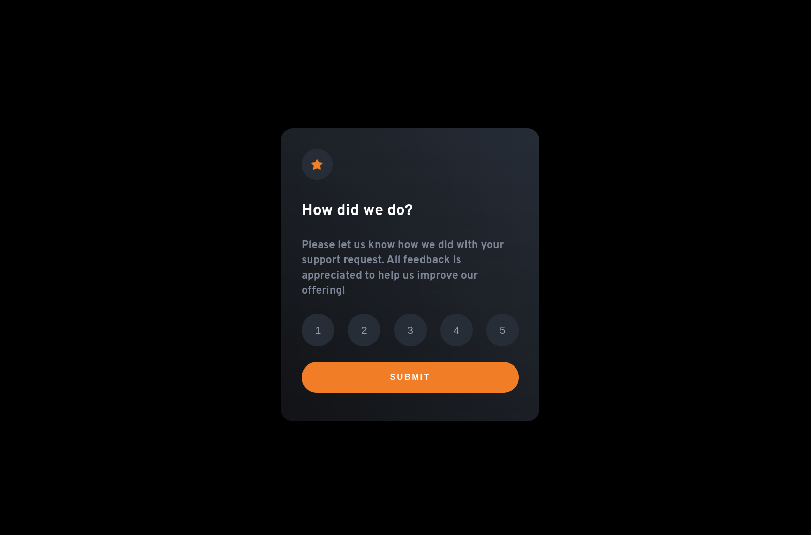
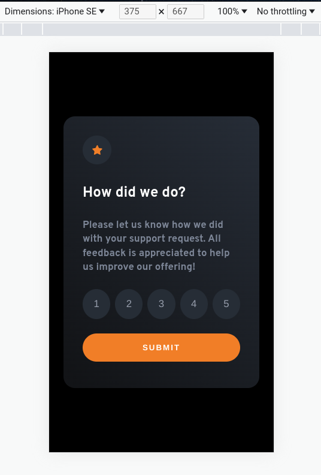

# Frontend Mentor - Interactive rating component solution

This is a solution to the [Interactive rating component challenge on Frontend Mentor](https://www.frontendmentor.io/challenges/interactive-rating-component-koxpeBUmI). Frontend Mentor challenges help you improve your coding skills by building realistic projects.

## Table of contents

-   [Overview](#overview)
    -   [The challenge](#the-challenge)
    -   [Screenshot](#screenshot)
    -   [Links](#links)
-   [My process](#my-process)
    -   [Built with](#built-with)
    -   [What I learned](#what-i-learned)
-   [Author](#author)

**Note: Delete this note and update the table of contents based on what sections you keep.**

## Overview

### The challenge

Users should be able to:

-   View the optimal layout for the app depending on their device's screen size
-   See hover states for all interactive elements on the page
-   Select and submit a number rating
-   See the "Thank you" card state after submitting a rating

### Screenshot




### Links

-   Solution URL: [Github](https://github.com/GabeGar/FM-interactive-rating-component)
-   Live Site URL: [GH-Pages](https://gabegar.github.io/FM-interactive-rating-component/)

## My process

### Built with

-   [React](https://reactjs.org/) - JS library
-   [Vite](https://vitejs.dev/)
-   Mobile-first workflow
-   CSS custom properties
-   Flexbox

### What I learned

-   Doing this project helped me reinforce a few react-related concepts, such as conditional rendering of content.
    As well as, conditionally adding classes to re-usable components, that may differ their states, accordingly.
    (E.g., setting one button to gain the color orange as an active state, per the challenge,
    while the others remain unchanged).

```js - react
// * In RatingBtn.jsx file
const RatingBtn = ({ selectedRating, onHandleRating, value }) => {
    const classes = `rating ${
        (Number(selectedRating) === value && "selected choice") || ""
    }`;

    return (
        <button className={classes} onClick={onHandleRating} value={value}>
            {value}
        </button>
    );
};

export default RatingBtn;
```

-   Had an issue I had with mobile devices having 'sticky-like' hover effects. Solved after googling,
    by appending one of my media queries w/ the following ---> and (pointer: fine).

```css
@media (hover: hover) and (pointer: fine) {
    /* Hover styles in here */
}
```

-   The above prevented hover styles on mobile devices with higher specificity, instead of relying on screen
    size, like i did before.

-   Overall, a neat challenge through and through.

## Author

-   Frontend Mentor - [@GabeGar](https://www.frontendmentor.io/profile/GabeGar)
